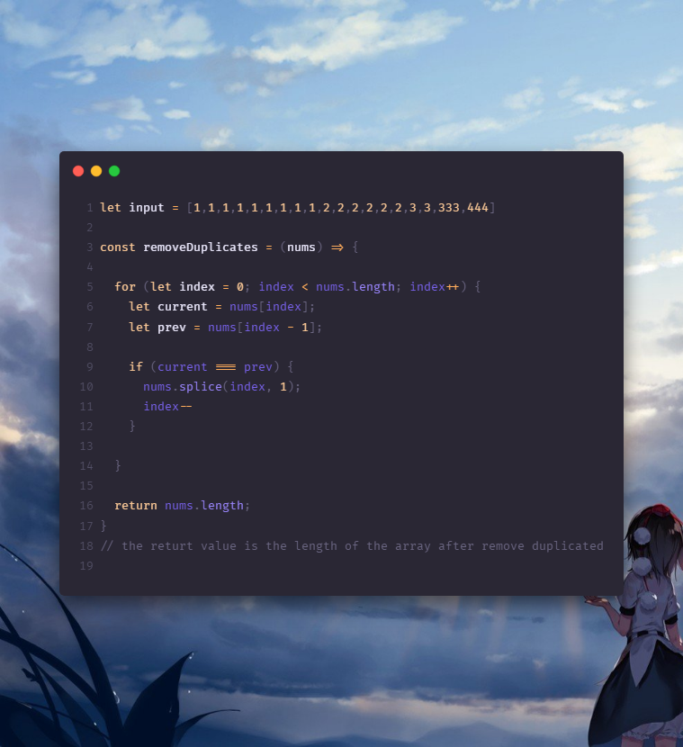

# Remove Duplicates from Sorted Array

Given an integer array nums sorted in **non-decreasing order**, remove the duplicates **in-place** such that each unique element appears only once. The **relative order** of the elements should be kept the **same**.

Since it is impossible to change the length of the array in some languages, you must instead have the result be placed in the **first part** of the array ```nums ```. More formally, if there are ```k``` elements after removing the duplicates, then the first ```k``` elements of nums should hold the final result. It does not matter what you leave beyond the first ```k``` elements.

Return ```k``` after placing the final result in the first ```k``` slots of ```nums```.

>Do ***not*** allocate extra space for another array. You must do this by ***modifying the input array*** ```in-place``` with O(1) extra memory.

---

## Custom Judge:
The judge will test your solution with the following code:

```javascript
int[] nums = [...]; // Input array
int[] expectedNums = [...]; // The expected answer with correct length

int k = removeDuplicates(nums); // Calls your implementation

assert k == expectedNums.length;
for (int i = 0; i < k; i++) {
    assert nums[i] == expectedNums[i];
}
```

### If all assertions pass, then your solution will be **accepted**.
---

## Example 1:
```javascript
Input: nums = [1,1,2]
Output: 2, nums = [1,2,_]

Explanation: Your function should return k = 2, with the first two elements of nums being 1 and 2 respectively.

It does not matter what you leave beyond the returned k (hence they are underscores).
```

## Example 2:
```javascript
Input: nums = [0,0,1,1,1,2,2,3,3,4]
Output: 5, nums = [0,1,2,3,4,_,_,_,_,_]

Explanation: Your function should return k = 5, with the first five elements of nums being 0, 1, 2, 3, and 4 respectively.

It does not matter what you leave beyond the returned k (hence they are underscores).
```

## Constraints:
```javascript
/*-*/ 1 <= nums.length <= 3 * 104
/*-*/ -100 <= nums[i] <= 100
/*-*/ nums is sorted in non-decreasing order.
```
---
## **_Solution_:**

